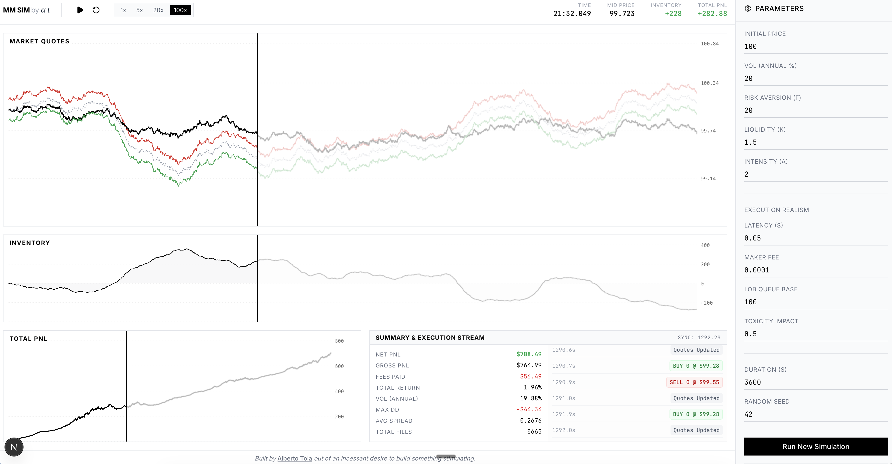

# Market Making Simulator



**Live Demo:** [market-making-simulator-production.up.railway.app](https://market-making-simulator-production.up.railway.app)

A high-performance C++ market making simulator paired with a sleek, real-time Next.js frontend. It simulates an Avellaneda-Stoikov market maker interacting with stochastic Poisson order flow in a discrete event environment, enriched with market mechanics like latency, queue position, fees, and order flow toxicity.

---

## 🎛️ Parameter Guide

### Core Parameters
* **Initial Price**: The starting price of the asset (e.g. `$100`).
* **Vol (Annual %)**: The asset's annual volatility. Higher vol means larger price swings.
* **Risk Aversion ($\gamma$)**: How aggressively the Market Maker penalizes inventory risk. When $\gamma$ is high, holding inventory forces the MM to shift reservation price and widen quotes to unload position quickly.
* **Liquidity ($k$)**: Taker sensitivity to quote distance. High $k$ means order arrival rates drop sharply as quotes move further from the mid-price.
* **Intensity ($A$)**: Base market order arrival rate (average number of orders hitting the market per second).

### Execution Realism
* **Latency (s)**: Delay in seconds (e.g., `0.05s` = 50ms) for quote updates to reach the exchange. High latency leaves the MM exposed to getting picked off on stale quotes.
* **Maker Fee**: Exchange fee per filled order. Positive means fees paid, negative means maker rebate earned.
* **LOB Queue Base**: Queue depth (number of contracts/orders ahead of the MM) when a new quote is placed in the Limit Order Book.
* **Toxicity Impact**: Severity of adverse selection in toxic flow regimes. Biases incoming order arrival rates against the MM during market surges.

### Simulation Meta
* **Duration (s)**: Total simulation runtime in seconds (e.g., `3600s` = 1 hour).
* **Random Seed**: Pseudo-random number generator seed for exact simulation reproducibility.

---

## ⚙️ How It Works

1. **Geometric Brownian Motion (GBM)**: Mid-price evolves continuously based on annualized volatility and drift.
2. **Avellaneda-Stoikov Model**: Computes reservation price ($r = S - q \gamma \sigma^2$) and optimal spread ($\delta$) dynamically based on inventory $q$.
3. **Poisson Arrival Process**: Incoming buyer and seller orders arrive independently based on exponential distribution timers.
4. **Discrete Event Engine**: C++ priority queue processes 4 discrete event types (`MARKET_UPDATE`, `QUOTE_UPDATE`, `QUOTE_HIT_BUY`, `QUOTE_HIT_SELL`).

---

## 🚀 How to Run Locally

### 1. Build C++ Engine
```bash
mkdir -p build && cd build
cmake ..
make -j4
./tests      # Runs all 29 unit tests
```

### 2. Launch Next.js Web UI
```bash
cd frontend
npm install
npm run dev
```
Open `http://localhost:3000` in your browser.
